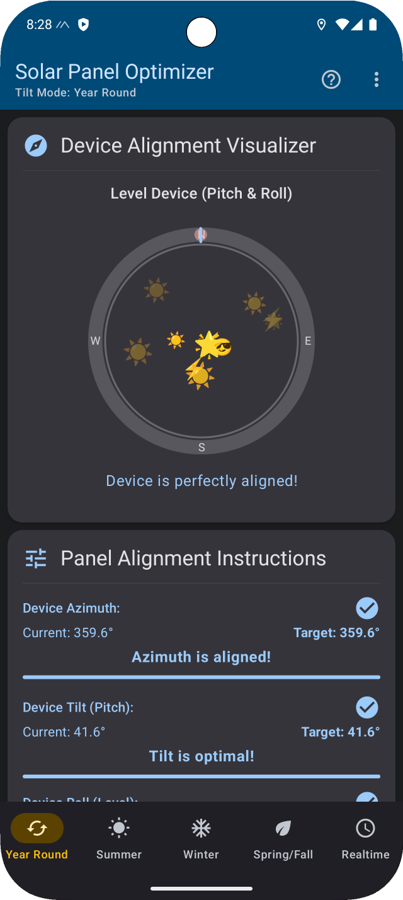
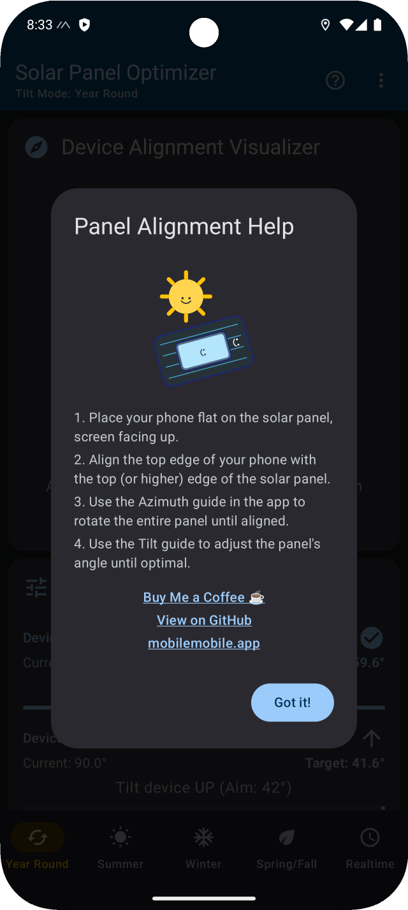

# SolPan

<p align="center">
  <strong>A simple and elegant mobile application that provides essential information about the sun's position and path.</strong>
</p>

<p align="center">
  <a href="https://play.google.com/store/apps/details?id=your.package.id">
    
  </a>
  <a href="https://github.com/your-username/SolPan/releases">
    
  </a>
</p>

---

## ☀️ Features

SolPan is a foundational application for understanding the sun's movement, built with a modern Android tech stack.

- **Clean, Intuitive UI:** A modern interface built with Jetpack Compose and Material 3.
- **Solid Foundation:** A well-structured project that's easy to build upon.
- **Solar Panel Optimization:** Use the phone sensors to orient your solar panels for maximum energy output.

## 📸 Screenshots

<p align="center">
  
  
</p>

## 🛠️ Building from Source

To build and run the project, you'll need:
- Android Studio Iguana | 2023.2.1 or later
- JDK 17

Clone the repository and open it in Android Studio:
```bash
git clone https://github.com/your-username/SolPan.git
```
The project can be built using the standard `./gradlew assembleRelease` command.

## 💻 Tech Stack & Libraries

This project is a showcase of modern Android development practices.
- 100% [Kotlin](https://kotlinlang.org/)
- [Jetpack Compose](https://developer.android.com/jetpack/compose) for declarative UI
- [Coroutines](https://kotlinlang.org/docs/coroutines-overview.html) & [Flow](https://developer.android.com/kotlin/flow) for asynchronous operations
- [Material 3](https://m3.material.io/) for UI components and design
- [Accompanist](https://google.github.io/accompanist/) for permissions and other utilities
- [Spotless](https://github.com/diffplug/spotless) with [ktlint](https://ktlint.github.io/) for code formatting

## 🙏 How to Contribute

Contributions are welcome! Whether it's reporting a bug, suggesting a feature, or submitting a pull request, all help is appreciated. Please see our `CONTRIBUTING.md` file for detailed guidelines. (You will need to create this file).

---

- **Website:** [mobilemobile.app](https://mobilemobile.app)
- **Support Us:** [Buy Me a Coffee](https://www.buymeacoffee.com/mobilemobile)
