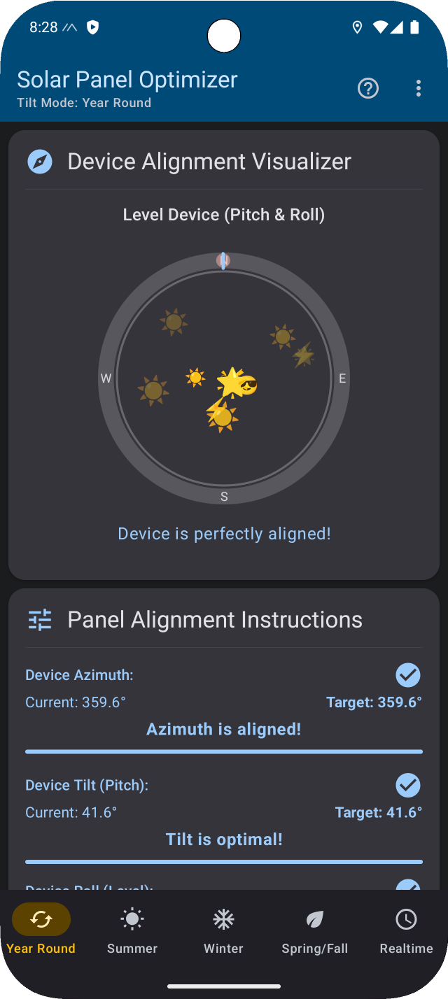
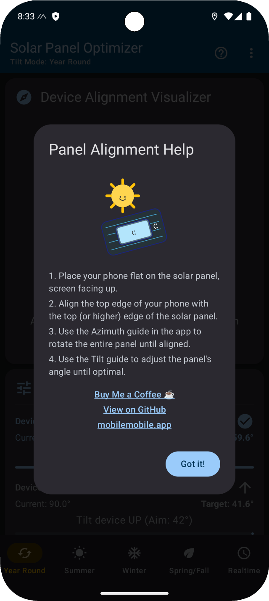

# SolPan

<p align="center">
  <strong>A simple and elegant mobile application that provides essential information about the sun's position and path.</strong>
</p>

<p align="center">
  <a href="https://play.google.com/store/apps/details?id=app.mobilemobile.solpan">
    
  </a>
  <a href="https://github.com/mobilemobilellc/SolPan/releases">
    
  </a>
  <br/>
  <a href="https://github.com/mobilemobilellc/solpan/actions/workflows/build.yml">
    
  </a>
</p>

---

## ☀️ Features

SolPan is a foundational application for understanding the sun's movement, built with a modern Android tech stack.

- **Clean, Intuitive UI:** A modern interface built with Jetpack Compose and Material 3 Expressive.
- **Solid Foundation:** A well-structured project that's easy to build upon.
- **Solar Panel Optimization:** Use the phone sensors to orient your solar panels for maximum energy output.
- **Adaptive Layout:** Staggered grid UI that adapts gracefully to both phone and tablet screen widths.

## 📸 Screenshots

<p align="center">
  
  
</p>

## 🏗️ Architecture

SolPan follows a straightforward single-screen architecture with a clear separation of concerns:

- **ViewModel + StateFlow** — UI state is managed in a single `ViewModel` and exposed as a `StateFlow`, keeping the composables stateless and easy to test.
- **Clean Analytics Abstraction** — All event tracking is routed through a testable `AnalyticsTracker` interface, decoupling the UI from any specific analytics backend.
- **Adaptive Layout** — The staggered grid automatically adjusts column count based on available window width, providing a polished experience on phones and tablets alike.

📖 **For detailed architecture, design decisions, performance tuning, security hardening, and testing strategies, see:**
- [**API Documentation**](https://mobilemobilellc.github.io/solpan/) - Dokka-generated reference for all public APIs
- [ARCHITECTURE.md](ARCHITECTURE.md) — Deep dive into modular design patterns
- [PERFORMANCE.md](PERFORMANCE.md) — Baseline metrics and optimization strategies
- [SECURITY.md](SECURITY.md) — Security practices and data protection
- [TESTING.md](TESTING.md) — Testing strategies and benchmarking
- [CONTRIBUTING.md](CONTRIBUTING.md) — Development workflow and project structure
- [RELEASE.md](RELEASE.md) — Semantic versioning, automated release workflow, changelog management

## 🛠️ Building from Source

To build and run the project, you'll need:
- [Android Studio Meerkat | 2025.1.1](https://developer.android.com/studio) or later
- JDK 21

Clone the repository and open it in Android Studio:
```bash
git clone https://github.com/mobilemobilellc/solpan.git
```

### Common build commands

```bash
# Assemble a release APK
./gradlew assembleRelease

# Format code
./gradlew app:spotlessApply

# Run static analysis
./gradlew app:detekt

# Run unit tests (45 tests)
./gradlew :app:testDebugUnitTest

# Regenerate screenshot reference images (after intentional UI changes)
./gradlew :app:updateDebugScreenshotTest

# Validate screenshots haven't changed
./gradlew :app:validateDebugScreenshotTest
```

## 💻 Tech Stack & Libraries

This project is a showcase of modern Android development practices.

| Category | Library / Tool |
|---|---|
| Language | 100% [Kotlin](https://kotlinlang.org/) |
| UI | [Jetpack Compose](https://developer.android.com/jetpack/compose) + [Material 3 Expressive](https://m3.material.io/) (1.5.0-alpha17) |
| Navigation | [Navigation 3](https://developer.android.com/jetpack/androidx/releases/navigation) (nav3 1.2.0-alpha01) |
| State management | [Lifecycle ViewModel + StateFlow](https://developer.android.com/topic/libraries/architecture/viewmodel) (2.11.0-alpha03) |
| Async | [Coroutines](https://kotlinlang.org/docs/coroutines-overview.html) & [Flow](https://developer.android.com/kotlin/flow) |
| Permissions | [Accompanist Permissions](https://google.github.io/accompanist/permissions/) |
| Persistence | [DataStore Preferences](https://developer.android.com/topic/libraries/architecture/datastore) |
| Analytics | Firebase Analytics + Crashlytics + Performance Monitoring, abstracted via `AnalyticsTracker` |
| Screenshot testing | [Android Compose Screenshot Testing](https://developer.android.com/studio/test/screenshot-testing) (`com.android.compose.screenshot`) |
| Code quality | [Detekt](https://detekt.dev/) + [Spotless](https://github.com/diffplug/spotless)/[ktlint](https://ktlint.github.io/) |
| Performance | [Baseline Profiles](https://developer.android.com/topic/performance/baselineprofiles) + ProGuard/R8 |

## 🙏 How to Contribute

Contributions are welcome! Whether it's reporting a bug, suggesting a feature, or submitting a pull request, all help is appreciated. Please see [CONTRIBUTING.md](CONTRIBUTING.md) for detailed guidelines.

---

- **Website:** [mobilemobile.app](https://mobilemobile.app)
- **Support Us:** [Buy Me a Coffee](https://www.buymeacoffee.com/mobilemobile)
