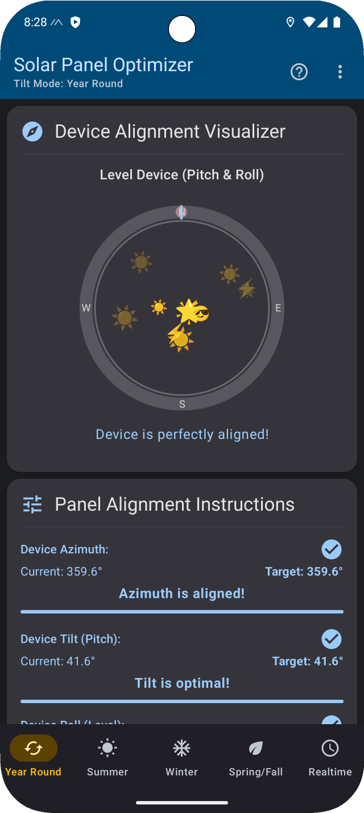
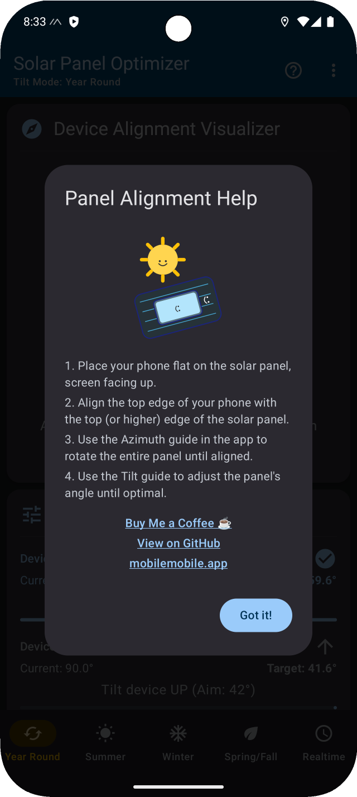

# SolPan

<p align="center">
  <strong>A simple and elegant mobile application that provides essential information about the sun's position and path.</strong>
</p>

<p align="center">
  <a href="https://play.google.com/store/apps/details?id=app.mobilemobile.solpan">
    
  </a>
  <a href="https://github.com/mobilemobilellc/SolPan/releases">
    
  </a>
  <br/>
  <a href="https://github.com/mobilemobilellc/solpan/actions/workflows/build.yml">
    
  </a>
</p>

---

## ☀️ Features

- **Clean, Intuitive UI:** A modern interface built with Jetpack Compose and Material 3 Expressive.
- **Solar Panel Optimization:** Use the phone sensors to orient your solar panels for maximum energy output.
- **Adaptive Layout:** Staggered grid UI that adapts to both phone and tablet screen widths.

## 📸 Screenshots

<p align="center">
  
  
</p>

## 🏗️ Architecture

State lives in a `ViewModel` and is exposed as a single `StateFlow`, so the composables stay stateless. Event tracking goes through the `AnalyticsTracker` interface rather than a Firebase call site, which is what makes it testable. The staggered grid picks its column count from the available window width.

- [**API documentation**](https://mobilemobilellc.github.io/solpan/) - Dokka reference for every module
- [ARCHITECTURE.md](ARCHITECTURE.md) - module layout and data flow
- [TESTING.md](TESTING.md) - test strategy and current coverage
- [PERFORMANCE.md](PERFORMANCE.md) - what to measure and how
- [SECURITY.md](SECURITY.md) - data handling and permissions
- [RELEASE.md](RELEASE.md) - versioning and the release workflow
- [ROADMAP.md](ROADMAP.md) - what is unfinished and what is planned
- [CONTRIBUTING.md](CONTRIBUTING.md) - how to work on this

## 🛠️ Building from Source

You need Android Studio and a JDK. CI builds on JDK 25; JDK 21 also works.

```bash
git clone https://github.com/mobilemobilellc/solpan.git
```

### Common build commands

```bash
# Assemble a debug APK
./gradlew :app:assembleDebug

# Format every module
./gradlew spotlessApply

# Static analysis (:app only, see ROADMAP.md)
./gradlew app:detekt

# Unit tests (31 tests)
./gradlew :app:testDebugUnitTest

# Coverage report, written to app/build/reports/jacoco/
./gradlew app:jacocoTestReport

# Regenerate screenshot reference images after an intentional UI change
./gradlew :app:updateDebugScreenshotTest

# Build the API documentation into build/dokka/html
./gradlew :dokkaGenerate
```

## 💻 Tech Stack

| Category | Library / Tool |
|---|---|
| Language | [Kotlin](https://kotlinlang.org/) 2.4.20 |
| Build | AGP 9.4.1 on Gradle 9.7.1, convention plugins in `build-logic/` |
| UI | [Jetpack Compose](https://developer.android.com/jetpack/compose) (BOM 2026.09.00) + [Material 3 Expressive](https://m3.material.io/) 1.5.0-alpha28 |
| Navigation | [Navigation 3](https://developer.android.com/jetpack/androidx/releases/navigation) 1.2.0-rc01 |
| State | [Lifecycle ViewModel + StateFlow](https://developer.android.com/topic/libraries/architecture/viewmodel) 2.11.0 |
| Async | [Coroutines](https://kotlinlang.org/docs/coroutines-overview.html) and Flow |
| Permissions | [Accompanist Permissions](https://google.github.io/accompanist/permissions/) |
| Persistence | [DataStore Preferences](https://developer.android.com/topic/libraries/architecture/datastore) |
| Analytics | Firebase Analytics, Crashlytics and Performance, behind `AnalyticsTracker` |
| Solar maths | [Commons Suncalc](https://shredzone.org/maven/commons-suncalc/) |
| Screenshot tests | [Compose Screenshot Testing](https://developer.android.com/studio/test/screenshot-testing) |
| Code quality | [Detekt](https://detekt.dev/) 1.23.8, [Spotless](https://github.com/diffplug/spotless) 8.10.2 with [ktlint](https://ktlint.github.io/) 1.8.0 |
| API docs | [Dokka](https://kotlinlang.org/docs/dokka-introduction.html) 2.2.0, published to GitHub Pages |

Exact versions live in [`gradle/libs.versions.toml`](gradle/libs.versions.toml); the table above will drift.

## 🙏 How to Contribute

Contributions are welcome. See [CONTRIBUTING.md](CONTRIBUTING.md), and [ROADMAP.md](ROADMAP.md) for work that is already known to need doing.

---

- **Website:** [mobilemobile.app](https://mobilemobile.app)
- **Support Us:** [Buy Me a Coffee](https://www.buymeacoffee.com/mobilemobile)
